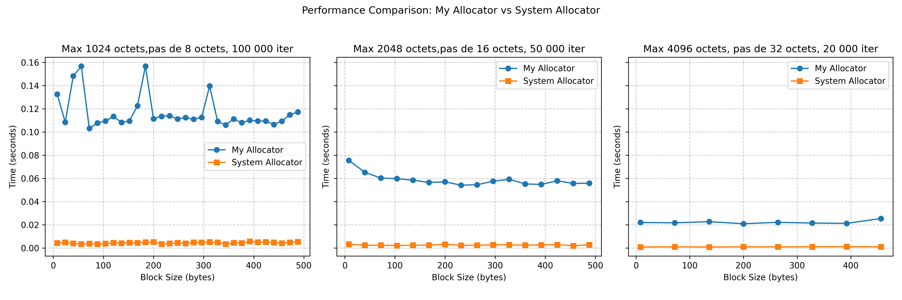

# Allocator
# Implémentation d'un Allocateur Mémoire Personnalisé

Ce projet consiste à implémenter un allocateur mémoire personnalisé en utilisant des mécanismes bas-niveau en C. L'objectif est de créer une version optimisée d'un allocateur mémoire, avec une gestion fine de la mémoire via `mmap` et `munmap`. Le projet est basé sur l'utilisation de `mmap` pour l'allocation mémoire et des optimisations pour améliorer les performances par rapport à l'allocateur système classique malloc/free.

## Instructions de Compilation et d'Exécution

### Compilation
Le projet utilise un fichier `Makefile` pour faciliter la compilation et l'exécution. Il permet de spécifier différents niveaux d'optimisation pour la compilation avec les options `-O2` et `-O3`. Vous pouvez choisir l'option de compilation avec la variable `O` :

- **Compilation par défaut (avec debug)** :
    ```bash
    make all
    ```

- **Compilation avec optimisation `-O2`** :
    ```bash
    make all O=O2
    ```

- **Compilation avec optimisation `-O3`** :
    ```bash
    make all O=O3
    ```

- **Nettoyage des fichiers générés** :
    ```bash
    make clean
    ```

### Exécution
- **Tests unitaires** : 
    Après compilation, vous pouvez exécuter les tests unitaires pour vérifier le bon fonctionnement de l'allocateur.
    ```bash
    ./build/my_allocator_tests
    ```

- **Tests de performance** :
    Pour exécuter les tests de performance et mesurer l'efficacité de l'allocateur comparé à l'allocateur système :
    ```bash
    ./build/performance_test
    ```
- **Afficher les performances avec `matplotlib`**

    Pour visualiser les performances des tests effectués, nous avons utilisé la bibliothèque Python `matplotlib` pour générer des graphiques comparant les performances des différents allocateurs mémoire.

    - ***Prérequis***

     1. **Activer l'environnement virtuel Python** :
      L'environnement virtuel Python est déjà présent dans le projet. Pour l'activer, utilise la commande suivante :
        - Sur Linux/macOS :
            ```bash
            source env/bin/activate
            ```
        - Sur Windows :
            ```bash
            .\env\Scripts\activate
            ```

    2. **Installer les dépendances Python** :
        Une fois l'environnement activé, installe les bibliothèques nécessaires (`matplotlib` et `numpy`) en exécutant :
        ```bash
        pip install -r requirements.txt
        ```
    3. **Exécuter le script Python :**
        Une fois les dépendances installées et l'environnement activé, exécute le script pour afficher les graphiques :
        ```bash
        python ./benchmarks/plot_performance.py
        ```
## Explication des Choix d'Implémentation

### Structure des Blocs
Chaque bloc alloué ou libre est représenté par une structure `Block`. Elle contient les informations suivantes :
- `size` : taille du bloc alloué.
- `next` : pointeur vers le bloc suivant.
- `free` : statut de l'allocation (1 pour libre, 0 pour alloué).
- `ptr` : pointeur vers l'espace mémoire alloué.

Cette structure permet de gérer efficacement l'allocation et la libération de mémoire. Lorsqu'un bloc est libéré, il est ajouté à une liste chaînée de blocs libres.

### Fonctionnement de `my_malloc`
1. La fonction `my_malloc` cherche un bloc libre qui peut contenir la taille demandée.
2. Si un bloc libre est trouvé, il est marqué comme occupé et retourné à l'utilisateur.
3. Si aucun bloc libre n'est disponible, un nouveau bloc est alloué à l'aide de `mmap` et ajouté à la liste des blocs.

### Fonctionnement de `my_free`
1. La fonction `my_free` cherche le bloc correspondant à l'adresse passée en argument.
2. Si le bloc est trouvé, il est marqué comme libre et la fonction `coalesce_free_blocks` est appelée pour fusionner les blocs libres adjacents.
3. Si l'adresse passée en argument n'est pas valide, un message d'erreur est affiché.

### Optimisations Appliquées

### Optimisations Appliquées

1. **Liste chaînée pour les blocs libres** :
   - La gestion des blocs libres se fait via une liste chaînée, permettant de réutiliser les blocs libérés sans avoir à appeler systématiquement `mmap`. Cela améliore l'efficacité de l'allocateur.

2. **Fusion des blocs libres adjacents** :
   - La fonction `coalesce_free_blocks` permet de fusionner les blocs libres adjacents pour réduire la fragmentation de la mémoire. Cela rend l'allocateur plus efficace dans la gestion de la mémoire.

3. **Réutilisation des blocs mémoires alloués** :
   - Lorsqu'un bloc libre est trouvé, il est réutilisé pour l'allocation, évitant ainsi des appels répétitifs à `mmap`.

4. **Suivi de la taille et de l'état des blocs** :
   - Chaque bloc contient des informations sur sa taille, son état (libre ou occupé) et un pointeur vers la zone mémoire allouée, ce qui permet de gérer précisément la mémoire.

5. **Segmentation en classes de tailles d'allocations** :
   - Les blocs sont segmentés en différentes classes de tailles afin d'éviter des appels trop fréquents à `mmap`. Cela améliore l'efficacité en utilisant des pools de mémoire pour différentes tailles d'allocations, ce qui permet d'allouer et de libérer plus rapidement des blocs de taille similaire.

6. **Alignement à la puissance de deux** :
   - Les tailles d'allocation sont alignées à la puissance de deux la plus proche, ce qui permet de garantir un meilleur alignement mémoire, réduisant ainsi les coûts d'accès à la mémoire et augmentant les performances globales. L'alignement est effectué sur des multiples de 8 octets.
7. **Multithreading** :
   - Pour optimiser l'allocation de mémoire dans des environnements multithread, l'allocateur utilise des mécanismes de verrouillage (mutex) afin de garantir la sécurité des accès concurrents aux listes libres et éviter les conditions de course. Chaque thread peut avoir son propre sous-ensemble de classes de blocs pour éviter les conflits.
   Pour le tester vous compiler le fichier ./src/my_allocator_multi_thread.c, c'est dans le makefile,parceque les tests ralentissaient ma machine.
   ```bash
   gcc -o multi_tread_test ./benchmarks/multithread_env_perf_test.c ./src/my_allocator_multi_thread.c -pthread
   ```   

8. **Perspectives : Optimisation de la recherche de blocs libres** :
   - Envisager l'utilisation de structures de données plus efficaces pour rechercher des blocs libres, comme des arbres ou des tables de hachage, pour accélérer l'allocation de mémoire.

## Résultats des Benchmarks

Les tests de performance ont été réalisés pour comparer la vitesse de notre allocateur mémoire personnalisé avec l'allocateur système (libc). Voici les résultats obtenus :

### Benchmarks : Nombre d'allocations/désallocations par seconde
Les tests ont mesuré le nombre d'allocations et de désallocations effectuées par seconde pour différentes tailles de blocs.

#### Graphique des résultats :
- Compilation sans optimisation system

- Compilation avec O2

- Compilation avec O3


Ces résultats montrent une amélioration significative de la vitesse d'allocation lorsque des optimisations sont appliquées, notamment la fusion des blocs libres et la réutilisation des blocs mémoire. Et on voit bien, plus la taille  des blocs augmente, plus on se rapproche des performances de malloc/free du system.

### Rapport ###
Pour plus de détails sur notre allocateur, vous avez à votre disposition un rapport détaillant tous ce qu'on a fait (AISE_25_RAPPORT-2).

## Conclusion

Ce projet a permis de créer un allocateur mémoire personnalisé avec une gestion fine des blocs et des optimisations pour améliorer les performances. Les optimisations mises en place ont permis d'améliorer les performances d'allocation et de réduction de la fragmentation mémoire, tout en maintenant la compatibilité avec les appels standards `malloc` et `free`.

Des optimisations futures pourraient inclure des stratégies avancées de gestion de mémoire pour des cas d'utilisation spécifiques.

